<!-- Xinze Li profile. Local SVGs; no third-party badge or typing service. -->

  <picture>
    <source media="(max-width: 600px) and (prefers-color-scheme: light)" srcset="assets/generated/header-mobile-light.svg" />
    <source media="(max-width: 600px)" srcset="assets/generated/header-mobile-dark.svg" />
    <source media="(prefers-color-scheme: light)" srcset="assets/generated/header-light.svg" />
    
  </picture>

  <a href="https://xinzelee.github.io/" title="Website">
    <picture>
      <source media="(max-width: 600px) and (prefers-color-scheme: light)" srcset="assets/generated/website-mobile-light.svg" />
      <source media="(max-width: 600px)" srcset="assets/generated/website-mobile-dark.svg" />
      <source media="(prefers-color-scheme: light)" srcset="assets/generated/website-light.svg" />
      
    </picture>
  </a>
  <a href="https://scholar.google.com/citations?user=YilrlZMAAAAJ" title="Scholar">
    <picture>
      <source media="(max-width: 600px) and (prefers-color-scheme: light)" srcset="assets/generated/scholar-mobile-light.svg" />
      <source media="(max-width: 600px)" srcset="assets/generated/scholar-mobile-dark.svg" />
      <source media="(prefers-color-scheme: light)" srcset="assets/generated/scholar-light.svg" />
      
    </picture>
  </a>
  <a href="https://www.linkedin.com/in/xinze-li-8199561b0/" title="Linkedin">
    <picture>
      <source media="(max-width: 600px) and (prefers-color-scheme: light)" srcset="assets/generated/linkedin-mobile-light.svg" />
      <source media="(max-width: 600px)" srcset="assets/generated/linkedin-mobile-dark.svg" />
      <source media="(prefers-color-scheme: light)" srcset="assets/generated/linkedin-light.svg" />
      
    </picture>
  </a>
  <a href="https://github.com/XinzeLee?tab=repositories&amp;sort=stargazers" title="Total stars received by public repositories">
    <picture>
      <source media="(max-width: 600px) and (prefers-color-scheme: light)" srcset="assets/generated/stars-mobile-light.svg" />
      <source media="(max-width: 600px)" srcset="assets/generated/stars-mobile-dark.svg" />
      <source media="(prefers-color-scheme: light)" srcset="assets/generated/stars-light.svg" />
      
    </picture>
  </a>

  <picture>
    <source media="(max-width: 600px) and (prefers-color-scheme: light)" srcset="assets/generated/lab-mobile-light.svg" />
    <source media="(max-width: 600px)" srcset="assets/generated/lab-mobile-dark.svg" />
    <source media="(prefers-color-scheme: light)" srcset="assets/generated/lab-light.svg" />
    
  </picture>

  <picture>
    <source media="(max-width: 600px) and (prefers-color-scheme: light)" srcset="assets/generated/slogan-mobile-light.svg" />
    <source media="(max-width: 600px)" srcset="assets/generated/slogan-mobile-dark.svg" />
    <source media="(prefers-color-scheme: light)" srcset="assets/generated/slogan-light.svg" />
    
  </picture>

<!-- Galaxy animation adapted from https://github.com/vinimlo/galaxy-profile, GPL-3.0. See ATTRIBUTION.md. -->
